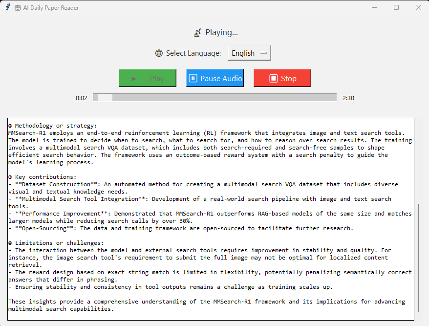

# 🎧 Daily Paper Reader

**Want to stay up to date with the latest breakthroughs in machine learning — even while making your morning coffee?**  
This lightweight desktop tool is designed for exactly that. Imagine starting your day like tuning into a science-driven news briefing: it fetches daily ML research papers from Hugging Face and reads them aloud using lifelike AI-generated voices. Ideal for busy researchers, students, and tech enthusiasts who want to learn effortlessly during breakfast, commuting, or breaks.

Built with Python, multiprocessing, and a smooth Tkinter GUI, this assistant helps you absorb key insights with minimal effort — no need to scan through abstract-heavy PDFs.

I'll continue adding new features and AI-powered tools to enhance learning and productivity.  
If you have ideas or feedback, I’d love to hear them — let’s build and learn together.  
If you enjoy using it, feel free to ⭐️ star the repo — more updates are on the way!

## 🖼️ Demo



## ✨ Features

- 📰 Fetches daily machine learning papers
- 🔊 Converts paper content to a short speech
- 🌐 Currently only support English and Chinese languages
- 🤖 Utilizes AI voices for natural, lifelike reading
- 💡 Simple, cross-platform GUI (built with Tkinter)
- ⚙️ Uses multiprocessing for responsive playback

## 🛠️ Installation

```bash
git clone https://github.com/yourusername/daily-paper-reader.git
cd daily-paper-reader
```

## 📦 Dependencies

- `Python 3.8+`
- `requests`
- `beautifulsoup4`
- `edge-tts`
- `python-dotenv`
- `openai`
- `pygame`
- `mutagen`

You can install the required Python packages using:

```bash
pip install -r requirements.txt
```

## 🚀 Usage
1. Set up your OpenAI API key in a `.env` file (you can create a `.env` file in the directory by your own or follow the description below).
   - The format should be: `OPENAI_API_KEY=your_api_key_here`
   - You can run the following command to generate your `.env` file:
```bash
cp .env.example .env
```
2. Run the application with `python UI.py`
3. Click on the button `play` to start extracting papers.
4. The daily paper will be fetched and displayed on the GUI.
5. The audio will be played automatically once the summary is generated.

## 📝 License

This project is licensed under the MIT License - see the [LICENSE](LICENSE) file for details.